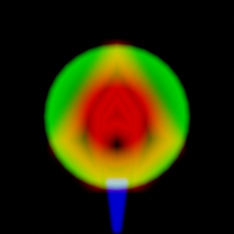
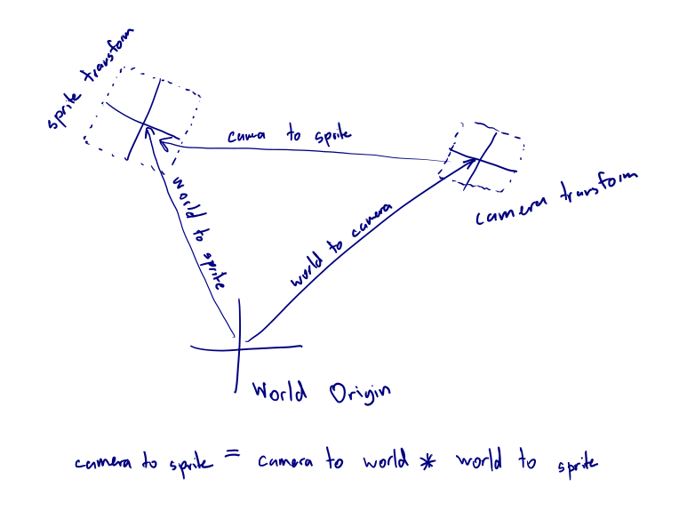

# Drawing The Player Ship

In the [shadertoy game](https://www.shadertoy.com/view/WlScWd), the 
ship is drawn using a signed distance field. That's because you can't 
load custom textures. Here, [we just learned how to bind 
textures](../binding_textures/index.md).
We still want our textures to contain a gradient (as that is what was used
for the neon effect), but now we can draw the ship in a graphics program
like Gimp rather than hand-coding lines as a bunch of coordinates.

Here's our ship texture:



You may notice it's a little different to the ship we're trying to draw.
That's because I want to be able to turn the engine on and off. I also
think a "collision shield" effect could be quite nice - to let the player
know when they hit things. For this reason, I've put three things on
different channels:

1) Red Channel: the ship
2) Blue Channel: the ship's engine flame
3) Green Channel: the ship's collision shield

All of these are distance-field-esque, allowing the "blur" to be tuurned
into a nice neon glow.

-------------------------------------------------
The main challenge here is drawing the player in the right place at
the right size. The vertex shader needs to consider the camera's 
transformation, the aspect ratio of the canvas, and the
transformation of the player's sprite.

To achieve peak runtime efficiency, we should compute/combine these 
matrices on the CPU, and then load a single transformation matrix to 
the GPU (which then processes it for each vertex). However, if we 
wanted to do that we'd need to have matrix maths in Rust. Sure, there 
are crates for that but it would increase the binary size and require 
more data massaging. So instead we will do all the matrix maths inside
the shader.

So what math needs to occur inside the shader? We need to end up with
a matrix that takes positions in sprite-local space and converts them
into canvas-clip space.

I find figuring this out much easier with a diagram:



Using the [One true naming 
scheme](https://www.sebastiansylvan.com/post/matrix_naming_convention/) 
for matrices makes this simpler. If we the matrix indicating the 
"sprite transform" matrix `world_to_camera` (because it represents the 
transformation from world space into sprite space), then we can invert 
it to get `camera_to_world`.

So we end up with the matrix chain:
```glsl
uniform mat3 world_to_camera;
uniform mat3 world_to_sprite;
uniform mat3 camera_to_clip; // Includes canvas resolution/aspect ratio

mat3 camera_to_world = inverse(world_to_camera);
mat3 clipspace_to_camera = inverse(camera_to_clipspace);
mat3 camera_to_sprite = camera_to_world * world_to_sprite;
mat3 sprite_to_clipspace = clipspace_to_camera * camera_to_sprite;
```


<canvas id="swoop_drawing_the_player"></canvas>
