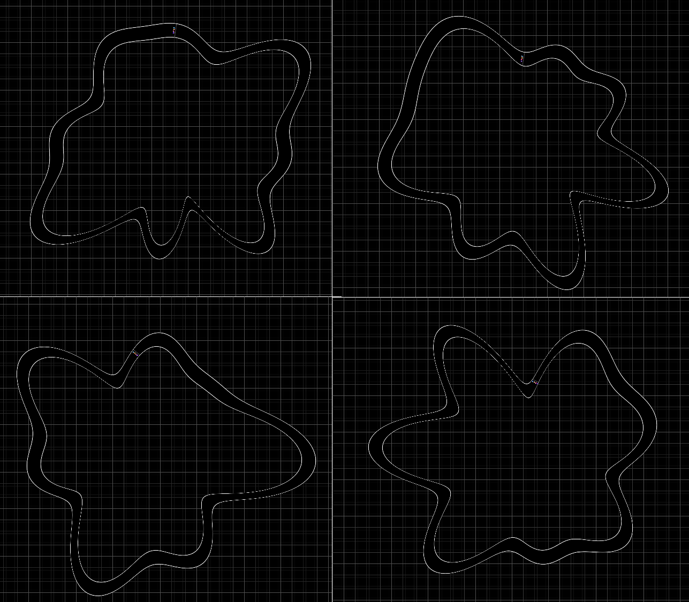
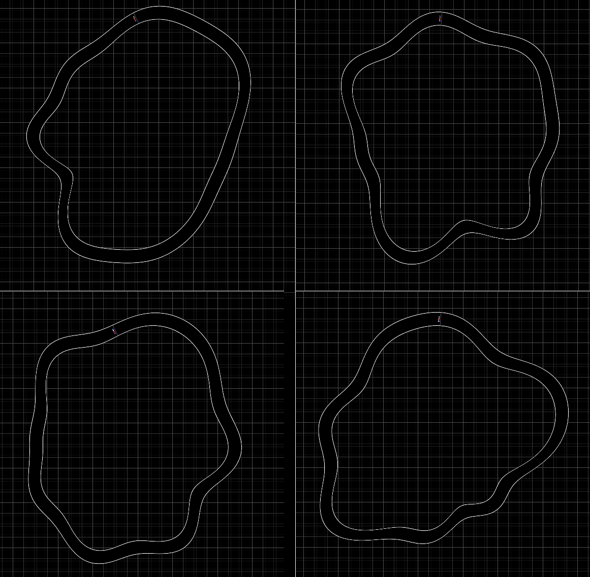
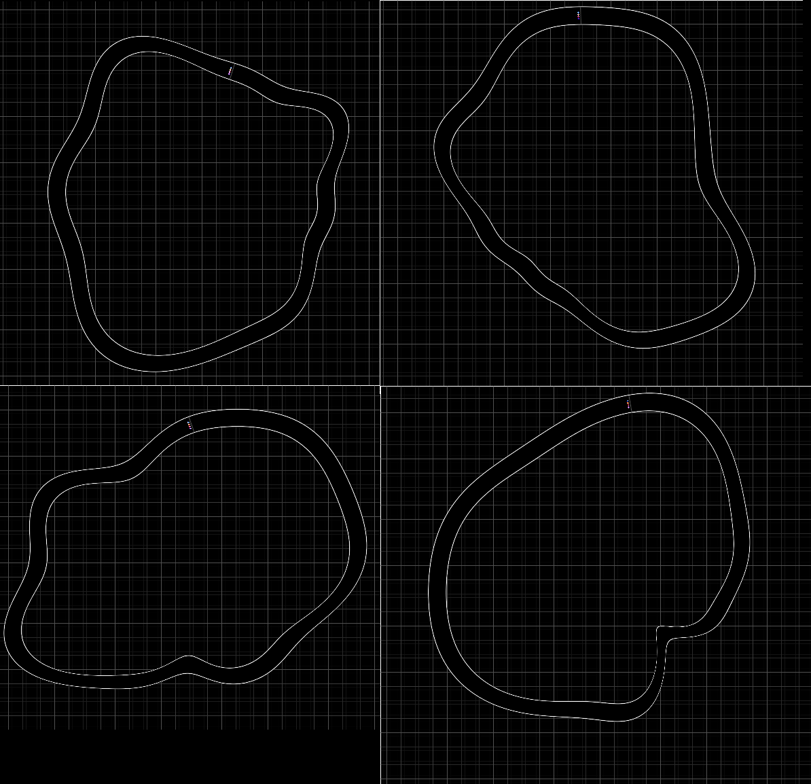

# Map Generation

The map is defined by a Fourier series. To generate a new fourier
series, we have to come up with a set of constants for it. We can generate
random numbers with use javascripts `Math.random()`, and can bind it
into our program with:

```rust
wasm_bindgen::prelude::wasm_bindgen;

#[wasm_bindgen]
extern "C" {
    #[wasm_bindgen(js_namespace = console)]
    fn log(s: &str);
    #[wasm_bindgen(js_namespace = Math)]
    fn random();
}
```

A naive implementation of a random map is:
```rust
    /// Change the sin and cosine constants to change the map course
    pub fn randomize(&mut self) {
        for i in 0 .. 8 {
            self.sin_consts[i] = (random() - 0.5) * 2.0;
            self.cos_consts[i] = (random() - 0.5) * 2.0;
        }
    }
```
Which creates maps like:


As you can see, the maps here have LOTS of corners. Racing the one on
the bottom left wouldn't be much fun. This occurs because the amplitude
of the high frequencies can be the same as the amplitude of the low
frequencies.

How about applying a scaling factor to the higher frequencies:

```rust
    pub fn randomize(&mut self) {
        const WAVINESS: f32 = 2.0;
        for i in 0 .. 8 {
            self.sin_consts[i] = (random() - 0.5) * 2.0 / ((i + 1) as f32) * WAVINESS;
            self.cos_consts[i] = (random() - 0.5) * 2.0 / ((i + 1) as f32) * WAVINESS;
        }
    }
```


Yeah, much better. There are nice big features, but there is still a lot
of high-frequency "wobbles". Maybe instead of having a `1/i` falloff we
can have a `1/(i^n)` falloff:

```rust
    /// Change the sin and cosine constants to change the map course
    pub fn randomize(&mut self) {
        const WAVINESS: f32 = 3.0;
        for i in 0 .. 8 {
            let rand1 = (random() - 0.5) * 2.0;
            let rand2 = (random() - 0.5) * 2.0;
            let amplitude = WAVINESS / f32::powf((i + 1) as f32, 1.3);
            
            self.sin_consts[i] = rand1 * amplitude;
            self.cos_consts[i] = rand2 * amplitude;
        }
    }
}
```
I found a power of 1.3 turned out quite nice, producing maps with 
straight lines, sweeping curves and the occasional corner:


This is the sort of thing you can fiddle with all day, so we'll leave it
here and move on.


<canvas id="swoop_map_generation"></canvas>
