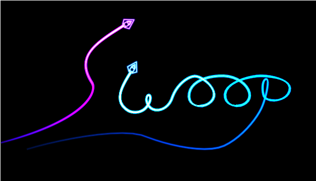

# Start Sequence
Currently the game just starts. There's no time for the player to prepare.
We need a title sequence with a "press enter to start". To do this
I want to render a logo as well as ... text.

Let's start with the logo, because that's the easiest.

## Rendering a logo
My idea for a logo is to have the word "swoop" drawn by two of the 
ships and their trails. One ship will write the "S" and the other will 
write "woop".
For this I need a to generate some trails with the correct points for
the shapes I want. I could do this by hand and trial-and-error, but
it's much easier to author the trail in, say, blender, and then
export the positions/tangents it into a rust file.

The rust file contains a struct:
```rust
pub struct Logo {
    pub trails: Vec<Trail>,
    pub ships: Vec<Ship>
}
```

And then a python script goes through and generates an initilizer
containing things like:
```rust
        let mut out = Self {
            trails: vec![],
            ships: vec![]
        };
        
        
        let mut trail = Trail::new(
            (0.699999988079071, 0.0, 1.0, 1.0),
            1.0,
            1.0,
        );
        trail.path.push_front(PathPoint {
            position: (-2.191507339477539, -0.6047587394714355),
            tangent: (-3.393470287322998, -0.7639043927192688),
            intensity: 1.0,
            width: 0.019999999552965164,
            brightness: 100.0,
        });
        trail.path.push_front(PathPoint {
            position: (-0.9643271565437317, 0.12513494491577148),
            tangent: (0.225080206990242, -0.3531510829925537),
            intensity: 1.0,
            width: 0.019999999552965164,
            brightness: 100.0,
        });
        trail.path.push_front(PathPoint {
            position: (-0.6066954731941223, 0.765639066696167),
            tangent: (-0.9081510305404663, -0.5753495693206787),
            intensity: 1.0,
            width: 0.019999999552965164,
            brightness: 100.0,
        });
        out.trails.push(trail);
        
// And so on
```

To render our logo, we can  move our existing game logic to a "play_game"
function, and create a new function called "show_logo":
```rust
    pub fn show_logo(&mut self) {
        self.check_resize();
        self.gl.clear(
            WebGl2RenderingContext::COLOR_BUFFER_BIT | WebGl2RenderingContext::DEPTH_BUFFER_BIT,
        );
        let camera_to_clipspace = [
            1.0,
            0.0,
            0.0,
            0.0,
            (self.canvas_resolution.1 as f32 / self.canvas_resolution.0 as f32),
            0.0,
            0.0,
            0.0,
            1.0,
        ];
        self.trail_sprite.camera_to_clipspace = camera_to_clipspace;
        
        let world_to_camera = Transform2d::new(0.0, -0.7, 0.0, 3.0).to_mat3_array();
        let world_to_trails = Transform2d::new(0.0, 0.0, 0.0, 1.0).to_mat3_array();
        
        self.trail_sprite.world_to_camera = world_to_camera;
        self.trail_sprite.world_to_sprite = world_to_trails;
        
        self.trail_sprite.setup(&self.gl);
        for trail in &self.logo.trails {
            self.trail_sprite.render(&self.gl, &trail);
        }
        
        self.ship_sprite.camera_to_clipspace = camera_to_clipspace;
        self.ship_sprite.world_to_camera = world_to_camera;
        for ship in &self.logo.ships {
            self.ship_sprite.setup(&self.gl);
            self.ship_sprite.render(&self.gl, &ship);
        }
        
    }
```
We can now swap this in place of the previous `animation_frame` function
to previous our title screen:



The cool thing about doing the logo this way rather than with a sprite is
that if we change how trails are rendered, or what a ship looks like,
the logo will update. Also, it means we don't have to pack a high-res 
sprite containing the logo into the binary.

Now, I think the player should be able to see the map in the background,
so let's extend our `show_logo` function to include the map sprite:

```rust
let map_sprite_transform = Transform2d::new(0.0, -1.0, 0.0, 0.1);
// Render the map
self.map_sprite.world_to_camera = world_to_camera;
self.map_sprite.camera_to_clipspace = camera_to_clipspace;
self.map_sprite.world_to_sprite = map_sprite_transform.to_mat3_array();
self.map_sprite.render(&self.gl);
```

Maybe in the future we can allow the user to cycle through maps? We'll
shelve that for now.

## Game start state machine
So now we have a function for showing the logo and a function for
playing the game. We should create an enum and some logic to allow
us to switch between them:

```rust
enum GameState {
    Menu,
    Playing,
}

<< snip >>

if self.key_map.start_game.active() {
    self.game_state = GameState::Playing;
    return;
}
```
I also had to add the start_game key to the keymap as per one of the
previous articles.

Now we need to tell the user to press the Enter key...

## Rendering Text


<canvas id="swoop_wingtip_trails"></canvas>


