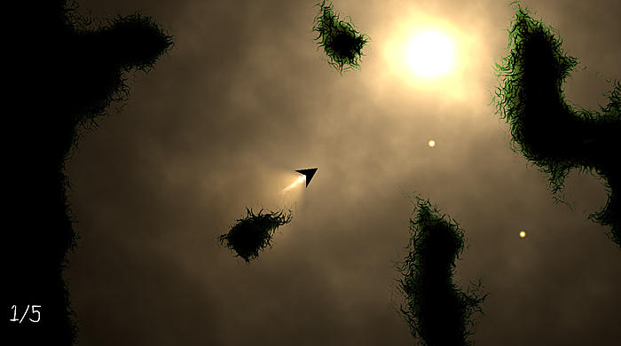

# A third game: Cavefly

Many years ago I made a game called "CaveFly" for a gamejam. It was pretty sucessful and won.
It was developed in the blender game engine which has long since dissappeared. Recently I've
wanted to remake it in a web-compatible format so that I can share it with others more
easily.

What does it look like? This:

Video:
<iframe width="560" height="315" src="https://www.youtube.com/embed/Xo3KWO04eHM" title="YouTube video player" frameborder="0" allow="accelerometer; autoplay; clipboard-write; encrypted-media; gyroscope; picture-in-picture" allowfullscreen></iframe>

Drawing on my experience with Swoop and a couple other openGL projects, I think I'm going to decide to pull in a couple more rust
libraries.

1. glam. Vectormath and matrices. It was a bit of a pain writing this ourselves in swoop, and as games grow in complexity
   I don't want to re-invent the wheel. GLAM is a fairly simple library that provides 2-4d vectors/matrices.

2. glow. Glow provides a very thin layer
   over opengles/webgl and means we don't have to keep pulling things in from web_sys and not quite so many things need `excepts()`. As a bonus, it's a lot more cross platform than directly using webGL. However, using glow does cut us off from using
   the browser to load textures for us, so we'll have to also pull in:

3. qoi-rust. Hey what? qoi is the "quite ok image format" and it is simple enough to be described on a single side
   of an A4 page. This rust library will allow is to store/transfer textures. In the past I used png format (which
   is far more common), but png format has a million different compression/pixel format options and making sure that
   our program supports all those takes a large amount of boilerplate. On the other hand, QOI is 8bpp RGB or RGBA.

## What makes up this game?

- A bunch of sprites: the tree trunks and grass stalks, the landing pad, the lights (when they are off).
- A background texture and lighting on it
- The player (a mesh) and an animated flame
- The map, which is four tiles rotated and distorted (yes really)
    - The Map generation algorithm, which is similar to a cellula automata
    - Collisions with the map
- Detecting when the player lands on the landing pad
- The start menu