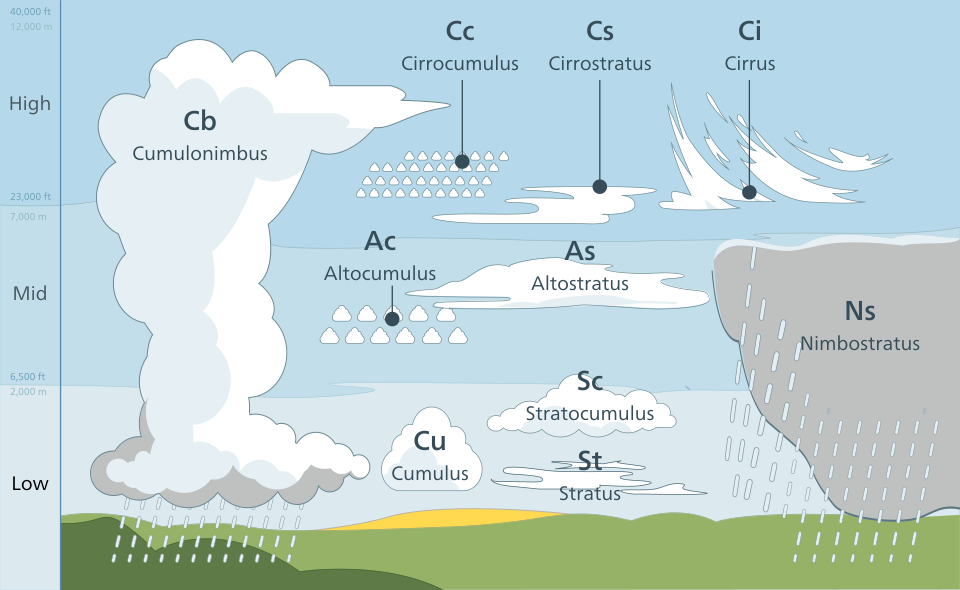
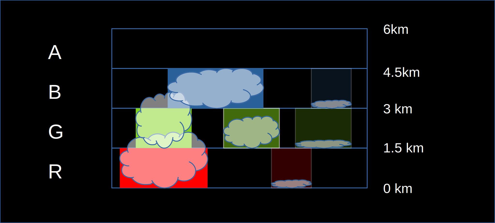
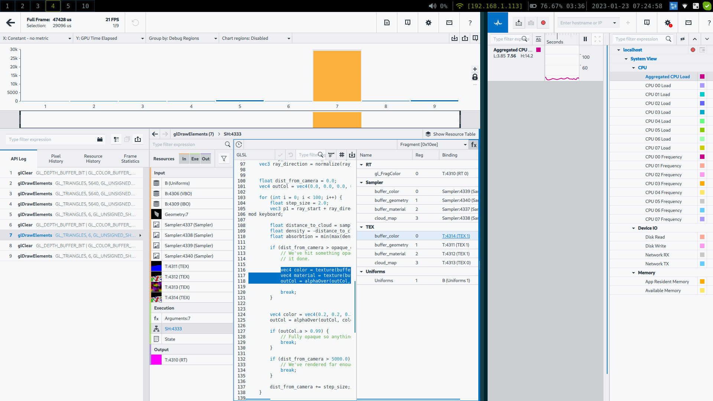

# In The Air Cloud Density

Currently our clouds are ... a bunch of evenly spaced spheres. That isn't very
cloud-like. Let's have a think about how we can make this better.

Let's focus on the overall shape of clouds first. They can be divided up by altitude. This great wikimedia image illustrates it nicely. 



As far as I can see the clouds are either thin and wispy (eg stratus) or chunky (eg cumulonimbus). Generally higher clouds are wispier.

From my own observation, clouds tend to come in layers. So why don't we map the
various image channels to different altitude levels. We can then use the value
to indicate the shape of the cloud:

 - 0 (no cloud)
 - 0.4999(no cloud)
 - 0.501 (very wispy cloud at the altitude floor)
 - 0.999 (very chunky cloud reaching from the bottom of one layer to the start of the next)

Why am I wasting all that space from 0 zero till 0.499? I have a suspiscion that I 
can use it like a signed distance field to speed up the raymarching later.

So here's how it will look:



Each channel has 256 possible values, This is mapped with 1 unit = 10m so each
channel covers a vertical space of 2.56km. However each channel has a base 
spacing of 1.5km so there is an overlap of 1.56km to allow for more interesting
cloudscapes.

What does sampling this look like?

```glsl
float sample_volume_density(vec3 point) {
    vec4 map_sample = (textureLod(cloud_map, point.rg / CLOUD_MAP_EXTENT, 0.0) - 0.5) * 2.0;

    vec4 layer_density = map_sample + CLOUD_DENSITY_MAP_OFFSET;
    vec4 layer_centerline = CLOUD_LAYER_HEIGHTS + (CLOUD_LAYER_THICKNESS - CLOUD_UNDERHANG) * layer_density;
    vec4 layer_thickness = max(CLOUD_LAYER_THICKNESS * layer_density, 0.0);
    vec4 distance_to_centerline = abs(point.z - layer_centerline);
    vec4 distance_to_surface = distance_to_centerline - layer_thickness;
    vec4 distance_to_layer = distance_to_surface;

    float distance_to_cloud = min(min(min(distance_to_layer.x, distance_to_layer.y), distance_to_layer.z), distance_to_layer.w);

    float density = -distance_to_cloud;
    return density * CLOUD_DENSITY_SCALE;
}
```

We can take advantage of the GPU's ability to work with vec4's so we don't have to
iterate over layers. Thus sampling multiple layers is essentially the same cost as
rendering a single layer.

To reach a 6km rendering distance with 100 raymarcher steps, each step has to be 
60m. If high altitude clouds are never rendered, we may reduce the vertical scale
to increase possible cloudscape complexity. I'll have a twiddle with the cloud layer stretch and spacing once I have a prototype.

So let's do this! Create a cloud texture, stretch it so that the pixels are 60m
of worldspace (so a 128px square covers 7.6km), and turn it into a density map.
Why am I going with such a small texture? Well, this function is going to get
sampled a lot, so if it fits into the GPU's cache, then it will run WAY faster.

So I built it, and it ran terribly. I wanted to do some
analysis and spector.js didn't give enough detail, so I installed intel's graphics performance
analyzer and added a desktop/glutin target for the program. This allowed me to debug graphics
performance without going through a web-browser.

The result:


All the frame duration is taken in a single draw call: the volumetrics one. This is
unsurprising though inconvenient. Maybe my implementation is just slow?
I couldn't see anything particularly bad, and a couple tweaks didn't make anything
faster. 

However, my demo in shadertoy is way faster - but there's a trick.
In shadertoy the clouds are rendered at half resolution but here I'm still
rendering them at screen resolution. Can we render our
geometry at full resolution but our clouds at half-resolution and then combine
them? Even though clouds have wispy bits no-one is likely to notice a 2x upscale. There 
may be slight edge artifacts, but it may be worth trying.

So anyway, here's the slow version that runs a full-screen cloud buffer. It'll run fine when small, but
if you fullscreen it on an intel card it'll drop a lot of frames.

<canvas id="in_the_air/cloud_density"></canvas>

