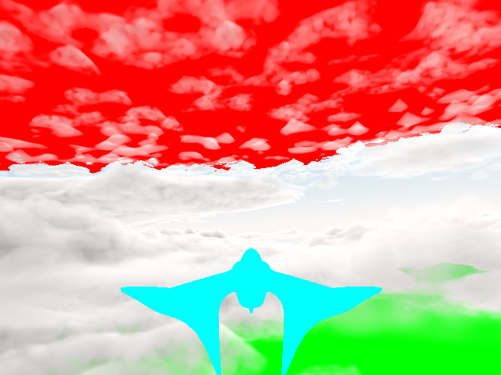
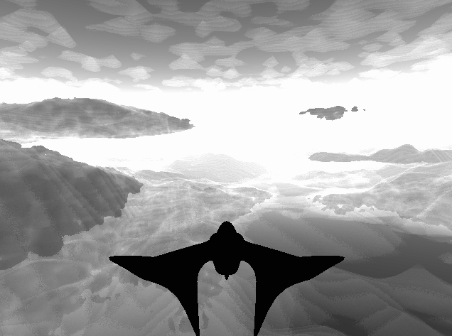
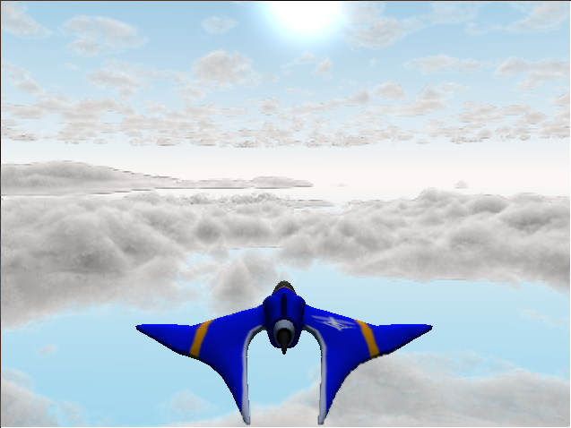

# Faster Clouds

Currently the clouds really chug on my laptop. It's dropping frames at 640x480, and is ~10fps at 1080p. I reckon we can do better.


## Don't Render clouds if outside of cloud box or behind opaque geometry
While we have a render sphere for draw distance, there is also a limit to how high and how low the clouds can be. There is no reason why we should bother to raymarch when outside of these bounds. Similarly, if there is geometry we don't need to continue raymarching.

This can be checked via:
```glsl
        // If we are higher than the clouds or lower than the clouds, don't compute clouds
        if (current_position.z > CLOUD_LAYER_HEIGHTS.w + CLOUD_LAYER_THICKNESS && ray_direction.z > 0.0) {
            backdrop = vec4(1.0, 0.0, 0.0, 1.0);
            break;
        }
        if (current_position.z < CLOUD_LAYER_HEIGHTS.x - CLOUD_UNDERHANG && ray_direction.z < 0.0) {
            backdrop = vec4(0.0, 1.0, 0.0, 1.0);
            break;
        }
```

And a small refactor to combine both draw distance, sky and opaque geometry all together:

```glsl
    // Backdrop
    vec4 backdrop = vec4(0.0);
    vec4 geometry = texture(buffer_geometry, uv);

    if (geometry.w == 0.0) {
        backdrop = vec4(renderSky(ray_direction), DRAW_DISTANCE);
    } else {
        float opaque_distance_from_camera = geometry.w;
        vec4 color = texture(buffer_color, uv);
        vec4 material = texture(buffer_material, uv);
        float materialTowardsSun = computeDensityTowardsSun(ray_start + ray_direction * opaque_distance_from_camera, 0.0);
        vec3 lightFromSunAtParticle = transmission(
            SUN_LIGHT * SUN_INTENSITY,
            materialTowardsSun
        );
        backdrop = vec4(
            light_surface(color, geometry, material, lightFromSunAtParticle).rgb,
            opaque_distance_from_camera
        );
    }

<snip>

        if (dist_from_camera > backdrop.a) {
            backdrop = vec4(0.0, 1.0, 1.0, 1.0);
            break;
        }

```
You can see in each of those I'm writing a color for each exit condition.
That means I can visualize that those conditions are being hit correctly.




# Where else are we using lots of raymarch steps?
If we write the loop counter into a variable, we can draw this one too:



This tells us what parts of our scene are taking lots of computation.
As expected, the further you see, the more likely it is to run out of steps.
It'll run out of steps before it hits the render distance limit.

We could increase step size, but that would decrease quality. But maybe we can
decrease step size at long distance. The current cloud implementation does
a clever long-stride and then backtracks if it encounters a cloud. We can
ditch the back-tracking after a certain render distance to make better use of steps. I tried it, and it did something funky with coloring. I have no idea
if it's to do with the backtracking or some step-size-dependence in my lighting code.

# Split out the volumetrics to a low resolution pass
Since clouds are fluffy, we should be able to get away with rendering them at 1/2 resolution. FOr this we do need another framebuffer. Fortunately this is
easy enough now as we have all the code fairly well abstracted, and we've just
split our shader to compute the backdrop of opaque and composite things on top.

So after a bit of fillding:


Ewwwww. Look at that outline around the cloud and around the vehicle. That's because it's half-resolution. Dang.
Also, there's now heaps of dupicated shader code. Maybe I need a preprocessor
to make it easier to have common functions.

Anywah, at least it is fast. I can hit 60FPS in fullscreen now. So I'll call that a win at least. But what can be done about the appearance? Currently we
use a proper falloff for mixing between the two, but this involves transferring
data about the material density, and I think this is tripping it up. If I can
compute the alpha directly in the volumetric pass, then not only is there less
duplicated shader code, but the compositing may also be cleaner.


<canvas id="in_the_air/faster_clouds"></canvas>