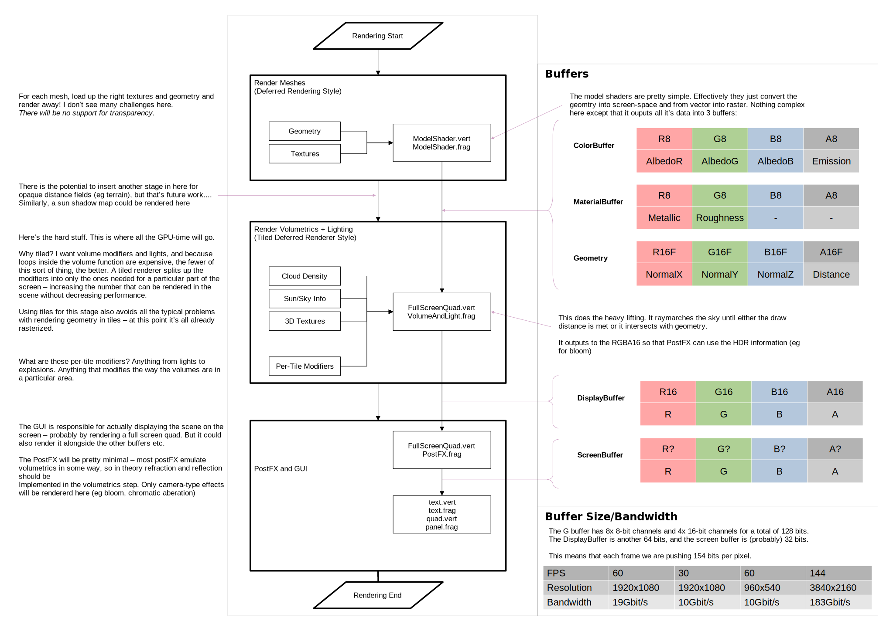

# An experimental renderer: In The Air

I came across a [set of drawings by Mike Doscher](https://www.deviantart.com/mikedoscher/gallery/46610677/spacecraft-of-the-first-world-war)
recently, depicting WW1-style battleships hanging in the sky, and I loved the imagery of it. Of
course that prompted me to think about if you could make a game about it. So what is the aim here?
I'm not planning to make a game, but I want to make a tech demo. This tech demo will probably be
similar to:

<iframe width="560" height="315" src="https://www.youtube.com/embed/5FLgmIQCt5A" title="YouTube video player" frameborder="0" allow="accelerometer; autoplay; clipboard-write; encrypted-media; gyroscope; picture-in-picture; web-share" allowfullscreen></iframe>

But with clouds!

So, features?

 1. There will be clouds:
    1. The player can fly through, above and below them.
    2. The clouds will be determined by a hand-drawn texture (ie so someone could make maps),
       and will be controllable enough to represent different times-of-day
    3. It shall run at 30FPS on my laptop (integrated graphics) at 960x540 resolution.
 2. There will be flying vehicles:
    1. The vehicles will be rendered as a mesh
    2. The vehicles can be obscured by the clouds, lit by the sky etc.

Stretch Goals:
 3. Smoke emitters in the scene!
 4. Actual Gameplay

Of course, the first part of this was to see if it was feasible to render clouds on my laptop at
performant framerates. Enter another shadertoy demo:

<iframe width="640" height="360" frameborder="0" src="https://www.shadertoy.com/embed/DljGzh?gui=true&t=10&paused=true&muted=false" allowfullscreen></iframe>

That hits ~45FPS at the target resolution, so there's still a few ms left over for rendering geometry.
(For those interested, it uses volumetric raymarching and is heavily based off the work presented in the 
[sig-graph 2015 talk "The real-time volumetric cloudscapes of horizon zero dawn"](https://www.guerrilla-games.com/read/the-real-time-volumetric-cloudscapes-of-horizon-zero-dawn)). 
I was rather pleased that the effect looks OK when rendered close up. 

I won't go into the details of hs this volumetrics is rendered in this document unless it effects the
renderer design - which it will.

# Technical details

Drawing on my experience with Swoop and a couple other openGL projects, I think I'm going to decide to pull in a couple more rust libraries.

1. glam. Vectormath and matrices. It was a bit of a pain writing this ourselves in swoop, and as games grow in complexity I don't want to re-invent the wheel. GLAM is a fairly simple library that provides 2-4d vectors/matrices.

2. glow. Glow provides a very thin layer
   over opengles/webgl and means we don't have to keep pulling things in from web_sys and not quite so many things need `excepts()`. As a bonus, it's a lot more cross platform than directly using webGL. However, using glow does cut us off from using the browser to load textures for us, so we'll have to also pull in:

3. png. We need to be able to decode images and PNG's are both compressed and support RGBA. I would have
   liked to use the QOI format, but support for that isn't very wide yet.

## Designing a Renderer
Similar to the (aborted) Pilot game, this uses a combination of meshes and raymarched rendering. So we
need a renderer that can handle both.

So here's the plan.

I'm sure it will evolve as we go, but at least it's a start!