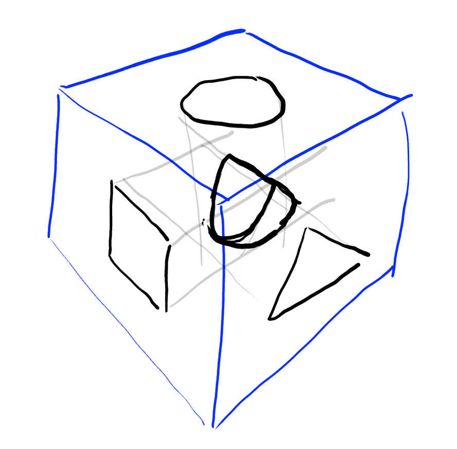
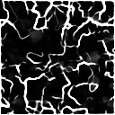

# Cave rendering

We need an environment for the player to fly through. One way would be
to build the world out of tiles. Or to procedurally generate a mesh.
But the route I'm going to use is to generate the cave entirely inside
a pixel shader.


## How do we render a cave?

Consider the line:
```
distance_from_sphere = sphere_radius - (sample_point - sphere_center).length() 
```
It computes the distance from the surface of a sphere given the sphere
parameters and a point in space to measure from.

So if we want to draw this sphere, then for every pixel we:
1) Start at a specific position
2) sample the sphere function
3) if the sphere function is positive we haven't hit the sphere yet, so we can move forward a bit and go back to step 2.
4) if the sphere function is negative, we have hit the sphere so we can compute the surface properties (normal, color etc.)

This is a technique called raymarching, and it is how all the 3d 
shadertoy demos are done.

So the question then arises: how do we write a mathematical function for
a cave? My first thought was moire' patterns between infinite grids of
primitive shapes, and this worked fairly well but the caves
are very regular:

<iframe width="640" height="360" frameborder="0" src="https://www.shadertoy.com/embed/3sGBWt?gui=true&t=10&paused=true&muted=false" allowfullscreen></iframe>

After browsing shadertoy a bit more and looking at other caves I considered
gyroids, 3d noise and a few other techniques, and then I found one called
[Cave Pillars by xor](https://www.shadertoy.com/view/Xsd3z7). It ran pretty
cast and the shader code was small. 

So I went and wrote my own version from scratch:
<iframe width="640" height="360" frameborder="0" src="https://www.shadertoy.com/embed/tltyRB?gui=true&t=10&paused=true&muted=false" allowfullscreen></iframe>

How does it work? It samples a 2D texture mapping it to the surfaces of
a 3D cube, and then intersects them:

Here's a sketch I did showing how three 2d images (a circle, square and
triangle) can be projected to form a solid:


It's hard to prediict what the intersection of a texture looks like. 
What would it look like if you used a texture like this on the one 
surface?



One cool thing we can do is we can use different textures on the
different surfaces, allowing anisotropy. We can also scale the textures
on the surfaces by a different factor. If these scaling factors are
prime, then the resulting cave will be fairly aperiodic. 

## Implementing it
So lets implement it in our game. We already have a background 
plane/shader, so we can work with that.The first thing we need to do is 
pass in the camera transform


<canvas id="pilot_cave_rendering"></canvas>
