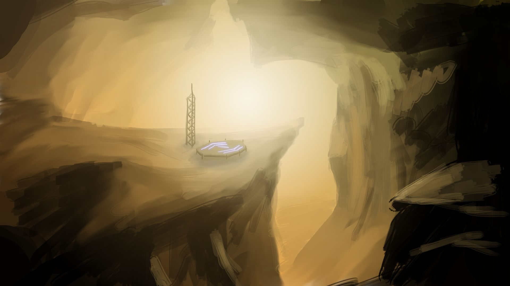
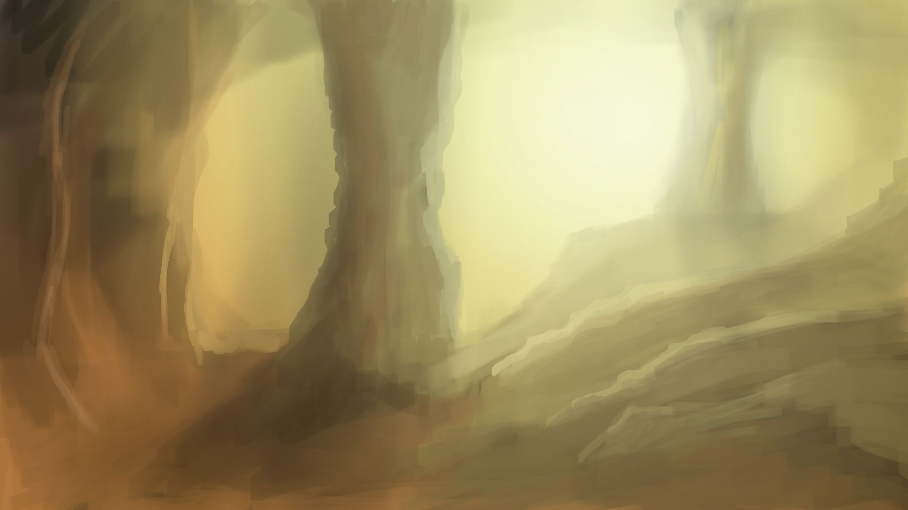
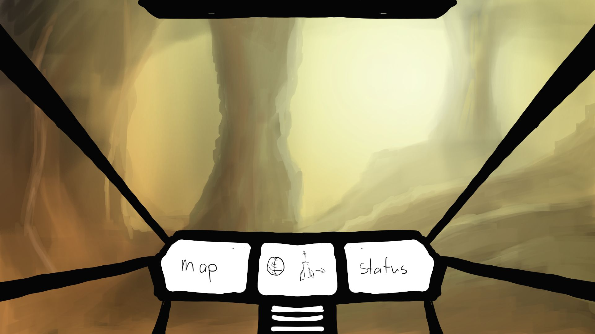

# Concept Art

I'm no expert artist, but doing some sketches helps figure out what
assets will be required, what sort of process we'll have to use for
rendering and a help cement the idea in my head.

## The Environment

I want caves that feel large, with features such as pillars and chasms
but also with areas of flatish ground.

## The Players Ship

Most modern games use heads-up-displays. I'm not a fan of this. I mean,
think about it, do you use a heads-up-display ever? Nope. Unless your
car is very modern it probably has at least some analog gauges, and 
even if it doesn't it has screens that generally display a fixed "thing".

I want the player to fly the craft like they would drive a car - so they
need to have a cockpit.

So the idea is that there is one screen showing a map of some sort (or
some way of telling the player where to go), another screen showing
flight data (velocity, angle) and a final screen showing ship status
(fuel, possibly damage).
There are a series of lights on the center console that light up on
things like:

1. Fuel Low
2. Collision likely to happen in the next few seconds

## Landing pads
The player can land anywhere, but their aim is to land on a landing pad.
These landing pads are built into the cave, either on flat ground or
protruding from walls.

Because the player is always looking forwards, landing pads need to have
features nearby that the player can use to line up. These could be
buildings, towers, light masts or anything really.

