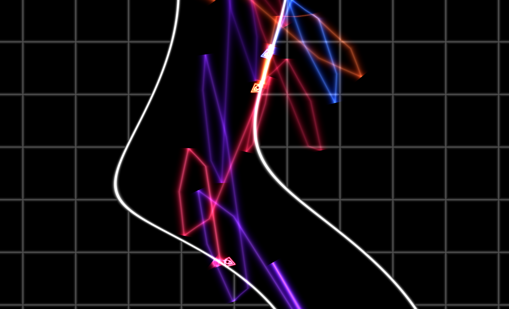

# Engine Trails

Wouldn't it be nice to know how far behind the guy ahead of you is?
That's why the shadertoy implementation has trails behind the ships.

This won't be done as a sprite, but it needs a whole strip of vertices
that will follow the path of the ship. We'll create a strip with fixed
positions and then use a uniform containing some description of the path
and a vertex shader to position the trail.

## Generating a strip of triangles
For the sprites we've been using the `TRIANGLE_STRIP` rendering method,
so this is relatively easy: a triangle is defined by a single vertex 
position and it joins onto the two previous vertex positions.

For each square "segment" we need to add two triangles AKA two new 
vertices. Here we create a the vertex array that fits within a (-1, 1) 
on the X axis and (0, 1) on the Y axis. The Y axis is subdivided into 
`SEGMENT_COUNT` segments.
```rust
let mut position_buffer = vec![-1.0, 0.0];
position_buffer.extend(&vec![1.0, 0.0]);

for i in 1..SEGMENT_COUNT + 1 {
    position_buffer.extend(&vec![-1.0, i as f32 / SEGMENT_COUNT as f32]);
    position_buffer.extend(&vec![1.0, i as f32 / SEGMENT_COUNT as f32]);
}
```

## Figuring out data storage
Now we need to figure out how the program will represent the ships 
path. Fortunately splines are something that are quite well understood.
The basis of nearly all splines (beziers, Catmull Rom etc.) is the 
[Cubic Hermite Spline](https://en.wikipedia.org/wiki/Cubic_Hermite_spline).
If you want a continuous curve you 
need the endpoint of each curve segment must be located in the same 
space and must have the same tangent (to avoid sharp corners). To do 
this you can derive a function that takes in two positions and two 
tangents and returns a function that interpolates smoothly between 
them. What Mr Hermite figured out was a set of four polynomials that 
would satisfy these constraints.

Aka: `curve_segment = F(point1, point2, tangent1, tangent2)`

All other cubic splines can be converted into this form. Most other 
forms of spline are made to approximate the tangets when all you have 
is a long set of points. However in our case, we can easily get the 
tangents at the points by examining the ships motion!

As we're working in 2D, we can use a single vec4 to contain both points
and tangents: `vec4(position_x, position_y, tangent_x, tangent_y)`, and
an array of these will nicely define the spline.

## Storing the data
We now need a datastructure to store all the data. We need to be able
to add data onto the end and remove data from the beginning, so the simple
solution is a Deque (double ended queue). Inside it we can store something
like:
```rust
pub struct PathPoint {
    pub position: Vec2,
    pub tangent: Vec2,
}

<< snip >>

pub struct EngineTrail {
    path: VecDeque<PathPoint>,
    max_length: usize,
    time_since_emit: f32,
    prev_position: Vec2,
}
```

To convert it into an array that can be loaded to our vertex structure
we can iterate through it and flatten it into an array of `f32`'s.
We have to do this iteration because the dequeue isn't continuous in
memory, so even if we stored f32's inside the dequeue directly, we'd still
have to do some processing.

```rust
impl EngineTrail {
    ...
    /// Converts to a buffer containing position/tangent data and one
    /// containing intensity data
    pub fn path_data_buffer(&self) -> Vec<f32>,) {
        let mut point_buffer = vec![];

        for point in self.path.iter() {
            point_buffer.push(point.position.0);
            point_buffer.push(point.position.1);
            point_buffer.push(point.tangent.0);
            point_buffer.push(point.tangent.1);
        }

        point_buffer
    }
}
```

Now we need to fill our dequeue with data. From the ship we can find the
position of the engine trail:
```rust
impl Ship {
    ...
    pub fn get_engine_position(&self) -> Vec2 {
        let offset = self.position.transform_vec((0.0, -0.4));
        (self.position.x + offset.0, self.position.y + offset.1)
    }
}
```

And for each ship we can pass this into our engine trail data storage:
```rust
impl App {
    // Trails
    for (ship, trail) in self.ship_entities.iter().zip(self.engine_trails.iter_mut()) {
        trail.update(
            dt as f32,
            ship.get_engine_position(),
        );
    }
}

<< snip >>

impl EngineTrail {
    ...
    pub fn update(&mut self, dt: f32, position: Vec2, intensity: f32) {
        self.time_since_emit += dt;

        // Ensure the path is completely full of points. Because they
        // have a tangent of zero, they will render with zero width
        // so not be visible.
        if self.path.len() != self.max_length {
            self.path.clear();
            for _ in 0..self.max_length {
                self.path.push_back(PathPoint {
                    position: position,
                    tangent: (0.0, 0.0),
                });
            }
            assert!(self.path.len() == self.max_length)
        }
        
        // Find the ships actual velocity at this instant of time
        let current_tangent = (
            (self.prev_position.0 - position.0) / dt,
            (self.prev_position.1 - position.1) / dt,
        );
        self.prev_position.0 = position.0;
        self.prev_position.1 = position.1;

        // If it's time to add a new segment, rotate the array, making
        // the current zeroth PathPoint into the first PathPoint, the
        // first PathPoint into the second PathPoint etc.
        if self.time_since_emit > TIME_PER_SEGMENT {
            self.path.rotate_right(1);
            self.time_since_emit = dt; // If this is zero, the tangent = 0
        }
        
        {
            // Update the zeroth PathPoint with information about the
            // ship from this instant.
            let first = self.path.get_mut(0).expect("path invalid");
            first.position.0 = position.0;
            first.position.1 = position.1;
            first.tangent.0 = current_tangent.0 * self.time_since_emit;
            first.tangent.1 = current_tangent.1 * self.time_since_emit;
        }
    }
}
```
Hopefully it's fairly clear how it works. The zeroth element always 
represents where the ship is _now_ and what direction it is traveling 
in _now_. Whenever a new point is emitted, the zeroth element becomes the
first element, and the last element is now the zeroth element.

The tangent is computed by difference in position rather than reading
the ships velocity because the physics velocity does not necessarily
represent the ships change in position in some situations - such as 
when the ship collides with something. In this case the physics engine
manipulates the position to resolve the collision without altering the
velocity to match. So by storing the `previous_position` the tangent
matches the actual change in world coordinates.


## Moving the vertices
Positioning the vertices is done inside the vertex shader - allowing the
computation to be done in parallel.

Given that our triangle strip ranges from (0, 1), we can compute the position
of the information in the array using:
```glsl
float vert_id_raw = uv.y * (float(point_buffer_length) - 1.0);
float segment = floor(vert_id_raw);
int index_here = int(segment);
float segment_percent = mod(vert_id_raw, 1.0);
```

`segment` and `index_here` are the position in the array, and 
`segment_percent` is how far the current vertex is between the two 
`index_here` and `index_here+1`.

So now we can extract our data:
```glsl
// Find the data that represents this curve segment
vec4 p1 = point_buffer[index_here];
vec4 p2 = point_buffer[index_here+1];

vec2 h0 = p1.xy; // Position
vec2 h1 = p2.xy;
vec2 t0 = p1.zw; // Tangents
vec2 t1 = p2.zw;

if (index_here == 0) {
    // Prevent interpolation in front of the ship
    // This is caused by the h0 and h1 being in very similar positions
    // and t1 causes the curve to precede.
    t1 = normalize(t1) * length(t0);
}
```
What's that `if (index_here == 0)` all about? Well, when a point is added
to the spline, it's just about at the ships position, and the tangent
is saying that the ship is moving forwards quite fast. As a result, the 
spline stretches ahead of the ship! To prevent this the very first 
segment copies the length of the tangent from the zeroth point (where 
the tangent can be scaled with time since the point was emitted) to the 
first point.

Now we can perform the interpolation to find our spline:
```glsl
    // Cubic Hermite Interpolation
    float t = segment_percent;
    float t2 = t * t;
    float t3 = t2 * t;
    float H0 = 2.0 * t3 - 3.0 * t2 + 1.0;
    float H1 = -2.0 * t3 + 3.0 * t2;
    float H2 = t3 - 2.0 * t2 + t;
    float H3 = t3 - t2;

    vec2 centerline = h0 * H0 + h1 * H1 + t0 * H2 + t1 * H3;
```

Turns out that having tangent information is also very useful when
we try to give our line thickness:
```glsl
vec2 tangent = normalize(mix(t0, t1, segment_percent));
vec2 normal = vec2(tangent.y, - tangent.x) * trail_width;
vec2 thickness = normal * aVertexPosition.x;

vec2 vert_position = centerline + thickness;
vec2 pos = (sprite_to_clipspace * vec3(vert_position, 1.0)).xy;
gl_Position = vec4(pos, 0.0, 1.0);
```

And we're good to go!

<canvas id="swoop/swoop_engine_trails"></canvas>

Now, there is a bit more to it than was described in this page. I added 
another array called `data_buffer` that contains if the engine is on or 
not, and to allow smooth motion (because the trail "snaps" every 0.25s, 
there is an offset based on `self.time_since_last_emit`, but that's just
wiring. I think most of the important parts are covered.

It's really cool to see the trail that purple leaves, and how he nails
those corners!

There are some limitations to this trail implementation: you can see 
some creasing sometimes on sharp corners/collisions, when you "blip" 
the throttle you can often observe the 0.25s spacing between datapoints,
but overall I'm happy with the result.

As a final note, issues with trail rendering can often look amazing. Can
you figure out what cause this issue?

