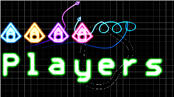

# Start Sequence
Currently the game just starts. There's no time for the player to prepare.
We need a title sequence with a "press enter to start". To do this
I want to render a logo as well as ... text.

Let's start with the logo, because that's the easiest.

## Rendering a logo
My idea for a logo is to have the word "swoop" drawn by two of the 
ships and their trails. One ship will write the "S" and the other will 
write "woop".
For this I need a to generate some trails with the correct points for
the shapes I want. I could do this by hand and trial-and-error, but
it's much easier to author the trail in, say, blender, and then
export the positions/tangents it into a rust file.

The rust file contains a struct:
```rust
pub struct Logo {
    pub trails: Vec<Trail>,
    pub ships: Vec<Ship>
}
```

And then a python script goes through and generates an initilizer
containing things like:
```rust
        let mut out = Self {
            trails: vec![],
            ships: vec![]
        };
        
        
        let mut trail = Trail::new(
            (0.699999988079071, 0.0, 1.0, 1.0),
            1.0,
            1.0,
        );
        trail.path.push_front(PathPoint {
            position: (-2.191507339477539, -0.6047587394714355),
            tangent: (-3.393470287322998, -0.7639043927192688),
            intensity: 1.0,
            width: 0.019999999552965164,
            brightness: 100.0,
        });
        trail.path.push_front(PathPoint {
            position: (-0.9643271565437317, 0.12513494491577148),
            tangent: (0.225080206990242, -0.3531510829925537),
            intensity: 1.0,
            width: 0.019999999552965164,
            brightness: 100.0,
        });
        trail.path.push_front(PathPoint {
            position: (-0.6066954731941223, 0.765639066696167),
            tangent: (-0.9081510305404663, -0.5753495693206787),
            intensity: 1.0,
            width: 0.019999999552965164,
            brightness: 100.0,
        });
        out.trails.push(trail);
        
// And so on
```
The code that does this is pretty ugly (as is a lot of exporter code), 
and is inside the `resources/logo.blend` file.

To render our logo, we can  move our existing game logic to a "play_game"
function, and create a new function called "show_logo":
```rust
    pub fn show_logo(&mut self) {
        self.check_resize();
        self.gl.clear(
            WebGl2RenderingContext::COLOR_BUFFER_BIT | WebGl2RenderingContext::DEPTH_BUFFER_BIT,
        );
        let camera_to_clipspace = [
            1.0,
            0.0,
            0.0,
            0.0,
            (self.canvas_resolution.1 as f32 / self.canvas_resolution.0 as f32),
            0.0,
            0.0,
            0.0,
            1.0,
        ];
        self.trail_sprite.camera_to_clipspace = camera_to_clipspace;
        
        let world_to_camera = Transform2d::new(0.0, -0.7, 0.0, 3.0).to_mat3_array();
        let world_to_trails = Transform2d::new(0.0, 0.0, 0.0, 1.0).to_mat3_array();
        
        self.trail_sprite.world_to_camera = world_to_camera;
        self.trail_sprite.world_to_sprite = world_to_trails;
        
        self.trail_sprite.setup(&self.gl);
        for trail in &self.logo.trails {
            self.trail_sprite.render(&self.gl, &trail);
        }
        
        self.ship_sprite.camera_to_clipspace = camera_to_clipspace;
        self.ship_sprite.world_to_camera = world_to_camera;
        for ship in &self.logo.ships {
            self.ship_sprite.setup(&self.gl);
            self.ship_sprite.render(&self.gl, &ship);
        }
        
    }
```
We can now swap this in place of the previous `animation_frame` function
to preview our title screen:


The cool thing about doing the logo this way rather than with a sprite is
that if we change how trails are rendered, or what a ship looks like,
the logo will update. Also, it means we don't have to pack a high-res 
sprite containing the logo into the binary.

Now, I think the player should be able to see the map in the background,
so let's extend our `show_logo` function to include the map sprite:

```rust
let map_sprite_transform = Transform2d::new(0.0, -1.0, 0.0, 0.1);
// Render the map
self.map_sprite.world_to_camera = world_to_camera;
self.map_sprite.camera_to_clipspace = camera_to_clipspace;
self.map_sprite.world_to_sprite = map_sprite_transform.to_mat3_array();
self.map_sprite.render(&self.gl);
```

Maybe in the future we can allow the user to cycle through maps? We'll
shelve that for now.

## Game start state machine
So now we have a function for showing the logo and a function for
playing the game. We should create an enum and some logic to allow
us to switch between them:

```rust
enum GameState {
    Menu,
    Playing,
}

<< snip >>

if self.key_map.start_game.active() {
    self.game_state = GameState::Playing;
    return;
}
```
I also had to add the start_game key to the keymap as per one of the
previous articles.

Now we need to tell the user to press the Enter key...

## Rendering Characters
Drawing text is a pain - wrapping words, kerning, scaling and a host of
other quirks. Lets make it as simple as possible: a sprite sheet of 
signed distance fields for the letters, a monospace font, and while we're
at it, why not use a single quad to draw a whole block of text rather
than a quad per character.

What do I mean by that? Well, if you have a monospace font, you can,
figure out what character a pixel is part of just by looking at it's
coordinages. Maybe a diagram will help:


This is how text rendering is done in shadertoy.
So, for this we need a spritesheet containing all the characters. With
the help of python and the python image library we can generate this
quite easily. But to enable a smaller texture, we really want a distance
field texture. With a bit more python finagling, We end up with the font
sheet:


This image is only 128px, and so is ~10kb, but if we treat it like a
signed distance field and threshold it, we can make it really big. Here 
it is 100 times enlarged:


Not so bad - and there shouldn't need to be any text that large! And you
do realize that on the character sheet each character is only 16 
pixels tall?

So now we need to get it into the engine. We've done this before with
the ship sprite, so I won't go into depth here. The fun part is the
fragment shader.
First we need to be able to select a part of the image to sample:

```glsl
vec4 get_sprite(vec2 uv, vec2 offset, vec2 size) {
        return texture(font_texture, uv * size + offset);
}
```

Our sprite sheet has all the characters the same size, so we can
index from the bottom up: `A = 10`, `B = 11`, `K = 20` etc.
So let's convert from these single integer indexes into an offset:

```glsl
vec4 get_character(vec2 uv, int character) {
        vec2 offset = vec2(ivec2(
                character % TILES.x,
                character / TILES.x
        )) * CHARACTER_SIZE;
        return get_sprite(uv, offset, CHARACTER_SIZE);
}
```

Now we can draw a single large character across our entire quad. How
about dividing it into segments:
```glsl
        vec2 coord = uv * 0.5 + 0.5;

        coord.x *= float(text_box_size.x);
        coord.y *= float(text_box_size.y);
        int letter_id = int(coord.x) + (text_box_size.y - int(coord.y) - 1) * text_box_size.x;
        coord.x -= floor(coord.x);
        coord.y -= floor(coord.y);
```
The variable `letter_id` tells us which segment we are in. 
If we were to run `get_character(coord, letter_id)` we would get the
quad filled with the characters from the font sheet in order. We want
to spell out a sentence, so let's create an array containing the
characters we want:

```glsl
vec4 characters[16] = vec4[16](
        vec4(0.0, 0.7, 1.0, 25.0),
        vec4(0.0, 1.0, 0.0, 47.0),
        vec4(0.7, 0.0, 1.0, 36.0),
        vec4(1.0, 0.0, 0.0, 60.0),
        vec4(1.0, 0.0, 0.0, 40.0),
        vec4(1.0, 0.0, 0.0, 53.0),
        vec4(1.0, 0.0, 0.0, 69.0),
        vec4(1.0, 0.0, 0.0, 69.0),
        vec4(1.0, 0.0, 0.0, 69.0),
        vec4(1.0, 0.0, 0.0, 69.0),
        vec4(1.0, 0.0, 0.0, 69.0),
        vec4(1.0, 0.0, 0.0, 69.0),
        vec4(1.0, 0.0, 0.0, 69.0),
        vec4(1.0, 0.0, 0.0, 69.0),
        vec4(1.0, 0.0, 0.0, 69.0),
        vec4(1.0, 0.0, 0.0, 69.0)
);

ivec2 text_box_size = ivec2(8, 2);
```

I've used a vec4 so the first three can represent color. So we can now
use the `neon` function from the ship/map/everything to make glowing
letters.
```glsl
        float char_sdf = get_character(coord, int(char_data.a)).r;
        FragColor = neon(
                1.0 - smoothstep(0.0, 0.5, char_sdf),
                vec4(char_data.rgb, 1.0),
                1.0
        );
```

So does it work?


Woohoo, technicolor writing in a single quad!

Now you've probably noticed that I put the ship sprite in the red 
channel of the character sheet. This means that with a small tweak we
can render the player ship as a character in our text. This may be
useful for displaying a leader-board.

The tweak to be able to access it is in `get_character`:

```rust
float get_character(vec2 uv, int character) {
        vec2 offset = vec2(ivec2(
                character % TILES.x,
                character / TILES.x
        )) * CHARACTER_SIZE;
        
        vec2 size = CHARACTER_SIZE;
        vec4 channel = vec4(0.0, 1.0, 0.0, 0.0);
        
        if (character == -1) {
                size = vec2(1.0);
                offset = vec2(0.0);
                channel = vec4(1.0, 0.0, 0.0, 0.0);
        }
        vec4 color = get_sprite(uv, offset, size);
        return dot(color, channel);
}
```
And now we can render a player ship inline as a character - and
it's high res (128px compared to 16px).



THe only thing left is a bit of vertex shader tweaking to position
and resize the text box.
```glsl
/// How many characters wide and high the text box is
uniform ivec2 text_box_dimensions;

/// how tall (in screen space) a single character should be
uniform float character_height;

/// Where the center of the text box should be located (in screen space)
uniform vec2 anchor;

/// Aspect ratio of the screen
uniform float screen_aspect;

<< snip >>

	float character_width = character_height * 5.0 / 9.0;
	vec2 text_box_size = vec2(
		character_width * float(text_box_dimensions.x),
		character_height * float(text_box_dimensions.y)
	);

	uv = aVertexPosition.xy;
	vec2 pos = uv * text_box_size + anchor;
	pos.x *= screen_aspect;
	gl_Position = vec4(pos, 0.0, 1.0);
```
Nothing too complex there, just scaling and positioning
based on a bunch of uniforms


## A Rust Interface
Currently the text is hardcoded into the shader as a bunch of numbers.
We want to be able to use a nicer API for displaying things.
Perhaps something like:
```rust
TextBox::new();
TextBox.extend("some characters", BLUE);

text_sprite.(TextBox);
```


So let's create a struct that contains all the important properties
for a text object:
```rust
/// The thing that can be drawn with a text sprite.
pub struct TextBox {
    data: Vec<f32>,

    // The text box wraps character wise and permits width*height characters to be displayed
    box_dimensions: (i32, i32),

    /// Height of a single character As percentage of screen size
    character_height: f32, 
    
    /// Where on the screen to draw the text. Positions the center of the text box with the screen ranging from -1.0 to 1.0 on both axis.
    anchor: (f32, f32)
}
```

We need to convert from the character "A" to it's numeric representation.
My initial implementation was going to be a match statement, then a hashmap.
After a bit of thinking, I came up with a simple solution:
```rust
impl TextBox {
    const VALID_CHARS: &'static str = "0123456789ABCDFEGHIJKLMNOPQRSTUVWXYZabcdefghijklmnopqrstuvwxyz:-<>*[] ";
    
<< snip >>

    /// The Text sprite has characters encoded in a non-standard order.
    /// This does the conversion
    fn encode_char(c: char) -> f32 {
        match Self::VALID_CHARS.find(c) {
            Some(id) => id as f32,
            None => -1.0,
        }
    }
```
Yup, a simple lookup in a vec. It's not `O(1)`, but with only 70 characters
it shouldn't be a problem. Any unknown characters result in `-1` which, if you
remember, is the ship sprite.

A simple function to do whole strings at a time:
```rust
    pub fn append_string(&mut self, string: &str, color: &[f32; 3]){
        for c in string.chars() {
            self.data.extend(color);
            self.data.push(Self::encode_char(c));
        }
    }
```

After that it's just a case of plumbing the data into the vertex shader.

## A bit of refactoring
The App struct is becoming quite large, holding a reference to all the sprites,
all the entities, and all the rendering code. This is also a problem because we
can't have a function:
```rust
impl App {
    fn game_update(&mut self) {
        self.render(&self.ships)
    }

    fn render(&mut self, &Vec<Ship>){
        ...
    }
}
```
If you're not a rustacean, you probably are wondering why you can't do this.
Well, the render function is getting passed a mutable reference to self and
a reference to self.ships. The mutable reference to self contains a reference
to ships, so we have a mutable and immutable reference to the same memory.

Because we now have to render both the main menu and the game while it's
playing, a bit of refactoring makes sense. I chose to split out all the
rendering code into a Renderer struct. This contains all the sprites and
contains a render function that (essentially) takes the world state:
```rust
pub struct Renderer {
    pub gl: WebGl2RenderingContext,
    canvas: HtmlCanvasElement,
    ship_sprite: ShipSprite,
    pub map_sprite: MapSprite,
    trail_sprite: TrailSprite,
    text_sprite: TextSprite,

    canvas_resolution: (u32, u32),
}

impl Renderer {

<<< snip >>>

pub fn render(
        &mut self,
        camera_transform: &Transform2d,
        ships: Vec<&Ship>,
        trails: Vec<&Trail>,
        text_boxes: Vec<&TextBox>,
    ) {
            << omitted >>
    }


```
Why is map_sprite and gl public? Yeah, they shouldn't be. In the previous code
the map uniforms were only set when the map was updated - which makes sense
because the map doesn't change very often. I kept this. It is not the best
architecturally, but there is only one map at a time and this will always(?)
be the case. I can tell I'm going to regret this later :)

Why does the render function take a Vector of references rather than a 
reference to a vector of objects? Thats because the things aren't always
stored in linear form. Consider the trails which were `Vec<(Trail, Trail, Trail)>` (I did change this though...) or that for the UI, storing a single
array of TextBox's may not make much sense. So a vector of references allows
flexibility in how/where the objects themselves are stored.

## Countdown
So, after that whole lot we can push "Enter" and the game starts immediately.
As a final part of the start sequence it would be great to have a "3", "2",
"1", "Go!" countdown.

We could do this as a separate game state in the GameState enum, but I think it
would be better to do it as part of the GamePlaying state.

Speaking of which, let's refactor the game playing state to a new file while 
we're at it.

```rust
pub struct GamePlay {
    pub map: Map,
    pub ship_entities: Vec<Ship>,
    pub trails: Vec<Trail>,
    pub camera: Camera,

    pub game_duration: f64,
}
```
And I moved all the logic (keyboard control, AI, physics) into this struct's
`update` function. I've also added a `game_duration` field:

```rust
impl GamePlay{
    pub fn new() -> Self {

        << snip >>

        Self {
            map,
            ship_entities,
            trails,
            camera,
            game_duration: -3.0
        }
    }

    pub fn update(&mut self, dt: f64, key_map: &KeyMap) {
        self.game_duration += dt;
        if self.game_duration < 0.0 {
            // Do the countdown!

        } else {
            calc_ship_physics(&mut self.ship_entities, &self.map, dt as f32);
        }

        self.steer_ships(key_map);
        self.update_trails(dt);

        self.camera.target_position.0 = self.ship_entities[0].position.x;
        self.camera.target_position.1 = self.ship_entities[0].position.y;
        self.camera.target_velocity.0 = self.ship_entities[0].velocity.x;
        self.camera.target_velocity.1 = self.ship_entities[0].velocity.y;
        self.camera.update(dt as f32);
    }
}
```

Oh hey, now the ships don't move for the first three seconds because the
physics isn't updated. 

We can now create a text box for the countdown and update it as needed

```rust

    pub fn update(&mut self, dt: f64, key_map: &KeyMap) {
        self.game_duration += dt;
        if self.game_duration < 0.0 {
            // Do the countdown!
            self.countdown_text.clear();
            
            let remaining = -self.game_duration.floor();
            let diff = 1.0 - remaining - self.game_duration;

            self.countdown_text.append_string(
                &format!(" {} ", remaining as u8),
                &[0.0, diff as f32, 0.0]
            );
        } else {
            if self.game_duration < 1.0 {
                self.countdown_text.clear();
                self.countdown_text.append_string(&"Go!", &[0.0, 1.0 - self.game_duration as f32, 0.0]);
            }
            calc_ship_physics(&mut self.ship_entities, &self.map, dt as f32);
        }
````

That was a long one but here we have it: A menu and a countdown at the
start of the game. 

<canvas id="swoop_start_sequence"></canvas>


