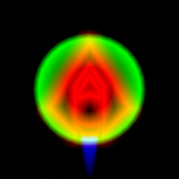
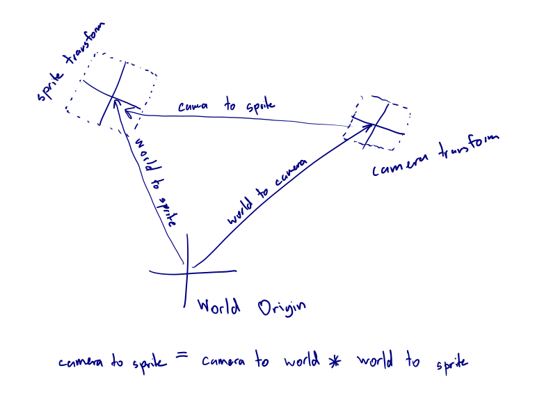

# Drawing The Player Ship

In the [shadertoy game](https://www.shadertoy.com/view/WlScWd), the 
ship is drawn using a signed distance field. That's because you can't 
load custom textures. Here, [we just learned how to bind 
textures](../binding_textures/index.md).
We still want our textures to contain a gradient (as that is what was used
for the neon effect), but now we can draw the ship in a graphics program
like Gimp rather than hand-coding lines as a bunch of coordinates.

Here's our ship texture:



You may notice it's a little different to the ship we're trying to draw.
That's because I want to be able to turn the engine on and off. I also
think a "collision shield" effect could be quite nice - to let the player
know when they hit things. For this reason, I've put three things on
different channels:

1) Red Channel: the ship
2) Blue Channel: the ship's engine flame
3) Green Channel: the ship's collision shield

All of these are distance-field-esque, allowing the "blur" to be tuurned
into a nice neon glow.

The fragment shader that does the rendering isn't too complex:
```frag
{{#include ../../src_rust/swoop/swoop_drawing_the_player/src/resources/ship.frag}}
```
You should be able to spot how the shader separates the engine flare 
from the ship, and how it generates the neon gradient of colors.

-------------------------------------------------
The main challenge here is drawing the player in the right place at
the right size. The vertex shader needs to consider the camera's 
transformation, the aspect ratio of the canvas, and the
transformation of the player's sprite.

To achieve peak runtime efficiency, we should compute/combine these 
matrices on the CPU, and then load a single transformation matrix to 
the GPU (which then processes it for each vertex). 
However, if we wanted to do that we'd need to have matrix maths in 
Rust. Sure, there are crates for that but it would increase the binary 
size and require more data massaging. So instead we will do all the 
matrix maths inside the shader. Note that we can only do this because 
we don't have any object hierarchies. If you had an object hierarchy 
you would need to do math on the CPU to find the final location of the 
objects.

So what math needs to occur inside the shader? We need to end up with
a matrix that takes positions in sprite-local space and converts them
into canvas-clip space.

I find figuring this out much easier with a diagram:



Using the [One true naming 
scheme](https://www.sebastiansylvan.com/post/matrix_naming_convention/) 
for matrices makes this simpler. If we the matrix indicating the 
"sprite transform" matrix `world_to_camera` (because it represents the 
transformation from world space into sprite space), then we can invert 
it to get `camera_to_world`.

So we end up with the matrix chain:
```glsl
{{#include ../../src_rust/swoop/swoop_drawing_the_player/src/resources/ship.vert}}
```

-------------------------------------------------

Now, obviously there is a little bit more to getting it to render than just
the shaders. For example,
the object representing the sprite is needs to contain all the new
uniforms:
```rust
pub struct ShipSprite {
    position_buffer: WebGlBuffer,
    program: WebGlProgram,
    attrib_vertex_positions: u32,
    
    uniform_ship_engine: Option<WebGlUniformLocation>,
    uniform_ship_texture: Option<WebGlUniformLocation>,
    uniform_ship_color: Option<WebGlUniformLocation>,
    
    uniform_world_to_camera: Option<WebGlUniformLocation>,
    uniform_world_to_sprite: Option<WebGlUniformLocation>,
    uniform_camera_to_clipspace: Option<WebGlUniformLocation>,

    pub ship_texture: WebGlTexture,
    pub ship_color: (f32, f32, f32, f32),
    pub ship_engine: f32,
    
    pub world_to_camera: [f32; 9],
    pub world_to_sprite: [f32; 9],
    pub camera_to_clipspace: [f32; 9],
}
```

And the uniforms have to be set at render-time:
```rust
gl.uniform_matrix3fv_with_f32_array(
	self.uniform_world_to_sprite.as_ref(),
	true,
	&self.world_to_sprite
);

// etc.
```

The various transformation matrices also have to be generated somehow. 
As mentioned before, I didn't want to pull in a full crate like `glam` 
or `nalgebra`, so instead I wrote a small module `transform.rs` 
containing:
```rust
{{#include ../../src_rust/swoop/swoop_drawing_the_player/src/transform.rs}}
```

---------------------------------------------------
Finally we have to set everything an invoke render. The nice thing
about working functionally here is that we can invoke render multiple
times after setting different parameters. As such we can render two
ships with one "ship sprite":

```rust
    pub fn animation_frame(&mut self) {
        let now = window().unwrap().performance().unwrap().now();
        let time = (now / 1000.0) as f32;

        self.check_resize();
        self.gl.clear(
            WebGl2RenderingContext::COLOR_BUFFER_BIT | WebGl2RenderingContext::DEPTH_BUFFER_BIT,
        );

        let mut ship_sprite_transform = Transform2d::new(0.0, 0.0, f32::sin(time), 0.1);

        let camera_transform =
            Transform2d::new(0.0, 0.0, 0.0, 1.0 / self.canvas_resolution.0 as f32);

        self.ship_sprite.world_to_camera = camera_transform.to_mat3_array();
        self.ship_sprite.camera_to_clipspace = [
            self.canvas_resolution.0 as f32,
            0.0,
            0.0,
            0.0,
            self.canvas_resolution.1 as f32,
            0.0,
            0.0,
            0.0,
            1.0,
        ];

		// Render the first ship
        self.ship_sprite.world_to_sprite = ship_sprite_transform.to_mat3_array();
        self.ship_sprite.ship_color = (0.0, 0.5, 1.0, 1.0);
        self.ship_sprite.ship_engine = 0.0;
        self.ship_sprite.render(&self.gl);

		// Render another ship
        ship_sprite_transform.x = f32::sin(time) * 0.5;
        ship_sprite_transform.y = f32::cos(time) * 0.5;
        ship_sprite_transform.rot = - std::f32::consts::PI / 2.0 - time;
        self.ship_sprite.world_to_sprite = ship_sprite_transform.to_mat3_array();
        self.ship_sprite.ship_color = (1.0, 0.5, 0.0, 1.0);
        self.ship_sprite.ship_engine = 1.0;
        self.ship_sprite.render(&self.gl);
    }
```


---------------------------------------------------
Proof that it all works:

<canvas id="swoop_drawing_the_player"></canvas>

