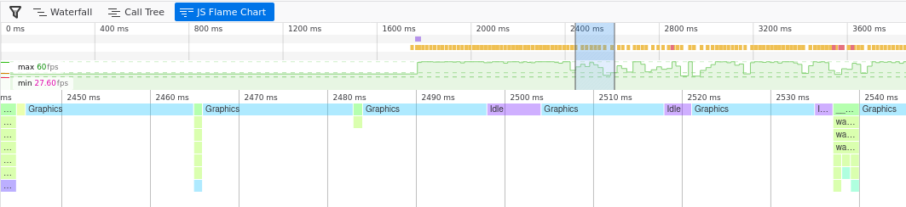

# Wingtip Trails and Optimizations

I think there should be additional trails emitted when the ship "slips 
sideways". This lets the user see that it's important to fly as straight
as possible, and it may also look pretty cool.

We already have a trail, so we just need some more. We can compute where
to put them with:
```rust
impl Ship {

<< snip >>

    pub fn get_wingtip_positions(&self) -> (Vec2, Vec2) {
        let offset_right = self.position.transform_vec((0.43, -0.2));
        let offset_left = self.position.transform_vec((-0.43, -0.2));
        (
            (
                self.position.x + offset_left.0,
                self.position.y + offset_left.1,
            ),
            (
                self.position.x + offset_right.0,
                self.position.y + offset_right.1,
            ),
        )
    }
}
```

And we can change our vector of trails to a vector containing a tuple
of trails, and update each in turn
```rust
pub struct App {
    trails: Vec<(Trail, Trail, Trail)>,
    ...
}


<< snip >>
// Create a set of trails for each ship
let mut trails = vec![];
for ship in ship_entities.iter() {
    const MAIN_TRAIL_WIDTH: f32 = 0.10;
    const WINGTIP_TRAIL_WIDTH: f32 = 0.02;
    const MAIN_TRAIL_BRIGHTNESS: f32 = 0.3;
    const WINGTIP_TRAIL_BRIGHTNESS: f32 = 1.0;

    trails.push((
        Trail::new(ship.color.clone(), MAIN_TRAIL_WIDTH, MAIN_TRAIL_BRIGHTNESS),
        Trail::new(
            ship.color.clone(),
            WINGTIP_TRAIL_WIDTH,
            WINGTIP_TRAIL_BRIGHTNESS,
        ),
        Trail::new(
            ship.color.clone(),
            WINGTIP_TRAIL_WIDTH,
            WINGTIP_TRAIL_BRIGHTNESS,
        ),
    ));
}


<< snip >>
// Update the trails
{
    // Trails
    for (ship, trail) in self.ship_entities.iter().zip(self.trails.iter_mut()) {
        trail.0.update(
            dt as f32,
            ship.get_engine_position(),
            f32::abs(ship.linear_thrust),
        );

        let wingtip_positions = ship.get_wingtip_positions();

        let raw_slip = ship.calc_slip() / 2.5;
        let base_slip = f32::abs(raw_slip);
        let left_slip = base_slip + raw_slip / 8.0;
        let right_slip = base_slip - raw_slip / 8.0;

        trail.1.update(
            dt as f32,
            wingtip_positions.0,
            f32::max(f32::min(left_slip, 1.0), 0.0),
        );
        trail.2.update(
            dt as f32,
            wingtip_positions.1,
            f32::max(f32::min(right_slip, 1.0), 0.0),
        );
    }
}
```
Here the `raw_slip` is how much the ships motion is perpendicular to the
way it is facing, and the left and right wingtip trails have slightly
different intensities based on which way the ship is sliding.
The raw slip is calculated with"
```rust
    pub fn calc_slip(&self) -> f32 {
        let global_travel = (self.velocity.x, self.velocity.y);
        let local_travel = self.position.to_local_direction(global_travel);

        local_travel.0
    }
```

Really, that's pretty much all there is to adding the wingtip trails.

## Optimization
This is quite a simple game: a handful of sprites and a pretty non-existant
physics engine. And yet it runs slowly on firefox on my laptop! Similarly
my cellphone struggles and my tablet doesn't show anything at all. So 
let's see what can be done.

The first aim is to minimize calls from WASM to JS. This can be done particularly
in the rendering, where it will also reduce the number of openGL calls.

### Setup functions for shaders
Currently for each ship we tell the GPU:

1. Use the ship shader, mix it into the scene with additive blending
2. Use the ship texture
3. Use the ship sprite vertex buffer
4. Configure the camera setup
5. Configure the ship color, engine etc.
6. Render the actual ship

Steps 1-4 are redundant for every ship other than the first one because
the shader settings and the camera position are the same for each ship.

As a result we can break our ship render function into a "setup" function
and a "render ship" function.
```rust
    pub fn setup(&mut self, gl: &WebGl2RenderingContext) {
        gl.use_program(Some(&self.program));
        gl.blend_func(WebGl2RenderingContext::ONE, WebGl2RenderingContext::ONE);

        gl.uniform_matrix3fv_with_f32_array(
            self.uniform_world_to_camera.as_ref(),
            true,
            &self.world_to_camera,
        );
        gl.uniform_matrix3fv_with_f32_array(
            self.uniform_camera_to_clipspace.as_ref(),
            true,
            &self.camera_to_clipspace,
        );

        bind_2d_texture_to_uniform(
            &gl,
            &self.uniform_ship_texture,
            &self.ship_texture,
            TextureUnit::Unit0,
        );

        gl.bind_buffer(
            WebGl2RenderingContext::ARRAY_BUFFER,
            Some(&self.position_buffer),
        );

        gl.vertex_attrib_pointer_with_i32(
            self.attrib_vertex_positions,
            2, // num components
            WebGl2RenderingContext::FLOAT,
            false, // normalize
            0,     // stride
            0,     // offset
        );
        gl.enable_vertex_attrib_array(self.attrib_vertex_positions);
    }

    pub fn render(&mut self, gl: &WebGl2RenderingContext, ship: &Ship) {
        gl.uniform_matrix3fv_with_f32_array(
            self.uniform_world_to_sprite.as_ref(),
            true,
            &ship.position.to_mat3_array(),
        );

        gl.uniform4f(
            self.uniform_ship_color.as_ref(),
            ship.color.0,
            ship.color.1,
            ship.color.2,
            ship.color.3,
        );
        gl.uniform1f(self.uniform_ship_engine.as_ref(), ship.linear_thrust);

        gl.draw_arrays(
            WebGl2RenderingContext::TRIANGLE_STRIP,
            0, //offset,
            4, // vertex count
        );
    }
```

Now we can render our ships with:
```rust
self.ship_sprite.world_to_camera = world_to_camera;
self.ship_sprite.camera_to_clipspace = camera_to_clipspace;
self.ship_sprite.setup(&self.gl);
for ship in &self.ship_entities {
    self.ship_sprite.render(&self.gl, ship);
}
```
Nice and simple, and we've removed 8 WASM -> JS -> GPU calls for each 
ship. We can do this for the other sprites as well.

So what did this optimization do? Well, without trails there were 66 
webgl calls per frame. With a single trail per ship as implemented on 
the previous page there were 122 webgl calls per frame. With three 
trails per ship this would mean there would be 234 calls if we kept the 
previous implementations. But now there are only 104 calls per frame! Sure,
there are still more vertices and more data flying around, but there is
less overhead.

(The version with 3 trails per ship has 17 draw calls, all the other 
calls are setting the shader program, setting uniforms etc. Another 
point of interest is that there are a total of 2444 vertices rendered)

### Combining data in trail shader
The trail currently uses two buffers: one for point information and one
for data information. It then indexes into both of these for each 
vertex. This requires two WASM -> JS -> GPU calls, and requires the GPU 
to hold both buffers in cache. We can combine these into one buffer and
then use:

```glsl
// Find the data that represents this curve segment
int index_here = int(segment) * 2;
vec4 p1 = point_buffer[index_here];
vec4 p2 = point_buffer[index_here+2];
vec4 d1 = point_buffer[index_here+1];
vec4 d2 = point_buffer[index_here+3];
```
To extract point positional information and data information. Again 
this reduces the JS/WASM calls, but it should also improves the GPU's 
caching as all the data for a particular point is near itself in 
memory.


### Increase map shader efficiency
Back in the original map shader we used two vec4's to hold the sin/cos 
constants. This was changed to a float array when we implemented physics
as it allowed easier comparison for differences between the GPU and CPU 
implementation.
Now that we know it's working we can put it back.
```glsl
// From this:
uniform float sin_consts[8];
uniform float cos_consts[8];

float track_radius = track_base_radius;

for (int i=0; i<8; i++) {
    float omega = float(i+1);
    track_radius += cos(angle * omega) * cos_consts[i];
    track_radius += sin(angle * omega) * sin_consts[i];
}

// To this:
uniform vec4 sin_consts[2];
uniform vec4 cos_consts[2];

vec4 angles_1 = vec4(angle, angle*2.0, angle*3.0, angle*4.0);
vec4 angles_2 = vec4(angle*5.0, angle*6.0, angle*7.0, angle*8.0);

vec4 sin_consts_1 = sin_consts[0];
vec4 sin_consts_2 = sin_consts[1];
vec4 cos_consts_1 = cos_consts[0];
vec4 cos_consts_2 = cos_consts[1];

float track_radius = track_base_radius;
track_radius += dot(sin(angles_1), sin_consts_1);
track_radius += dot(sin(angles_2), sin_consts_2);
track_radius += dot(cos(angles_1), cos_consts_1);
track_radius += dot(cos(angles_2), cos_consts_2);
```
The most important difference is that the version with the `uniform 
float sin_consts[8]` requires 8 samples into the array whereas the `uniform vec4 sin_consts[2];`
only requires two. It may not seem like a big difference as the same amount of
data is extracted, but my understanding of how uniforms work is that a GPU is
optimized for operating on vec4's, so a uniform float is actually just the first
element of a vec4 and the rest are discarded.

The other performance improvement is that we are now doing two 
`sin(vec4)` instead of eight `sin(float)`. My understanding of 
GPU architecture suggests that, similar to above, it will compute 
`sin(vec4)` in the same number of cycles as `sin(float)`, so two 
`sin(vec4)`s will run in 1/4 of the time as eight `sin(float)`s.

Trig is normally pretty heavy computations, as are array samples on a 
GPU, so here we've reduced both of them.


### Rust performance optimizations?
If it's slow, is it the rust/WASM that's slow? If we look at the firefox
profile we see:


So even on one frame where the animation frame callback is strangely long, the
maximum length is 2.72ms. For 60FPS the timing target is 16ms, so that's under
20% of the maximum possible time.

Looking at the flamechart we can see that the time is listed as "graphics".
I'm not quite sure what this means. 


At this point I discovered that I'm not able to get anything to maintain 
60FPS in firefox at fullscreen (1920x1080). Firefox has some open bugs 
on this and [_all_ webgl runs slowly on firefox on 
linux](https://bugzilla.mozilla.org/show_bug.cgi?id=1010527). As a 
result there's nothing I can do to solve this problem (it's to do with 
how firefox transfers the pixels from the canvas to the screen)

### How about the cellphone and tablet

Fortunately you can profile remotely on Chrome, so we can find out at 
least some information about what's going wrong on the cellphone. Let's
start with the tablet.

#### Fixing the Tablet

The tablet shows a black screen on all of the games in the swoop project,
even the very first "drawing the player ship" one, and yet it can 
render the "binding textures" example just fine. There is very minimal
difference between these two. One of the differences is all the matrix
transformations: `world_to_camera`, `world_to_sprite` etc. After
some debugging I found that it forcing the camera and clipspace matrices
to be identity matrices fixed the issue.
Previously these had the value:
```rust
let camera_to_clipspace = [
    self.canvas_resolution.0 as f32,
    0.0,
    0.0,
    0.0,
    self.canvas_resolution.1 as f32,
    0.0,
    0.0,
    0.0,
    1.0,
];
```
Some fiddling with feeding different values into these matrices resulted
in the discovery that at a certain value, they just stopped working.
On a whim, I tried changing `precision mediump float` to `precision 
highp float`, and it suddenly started working.

Clearly some more investigation into precision was needed. The OpenGL ES
specifications provide the minimum requirements for `mediump` as
a floating point range of `-2^14` to `2^14` (±16384), and a relative 
precision of `2^-10`. We aren't anywhere near 16k resolution, and I 
wouldn't think we were needing `1920.0e-10` precision, but maybe the 
inverse operation causes the matrices to become degenerate?


There are two solutions:

1. Use highp precision
2. Instead of feeding the canvas resolution through the camera/clipspace
matrices, use zoom and aspect ratio. 

Because #2 was simple to implement I gave it a go, but another problem 
showed up: all the motion now "snapped" between positions as the 
precision of the matrices allowed. So there's only the one
solution: use `highp`. However I will keep the changes from #2 as they 
mean that the camera object no longer needs to know the canvas 
resolution, which is a bit nicer architecturally.

The changes are
```rust
// CAMERA.RS
pub fn get_camera_matrix(&self) -> [f32; 9] {
    Transform2d::new(
        self.position.0,
        self.position.1,
        0.0,
        self.zoom,
    )
    .to_mat3_array()
}

// APP.RS
let world_to_camera = self
    .camera
    .get_camera_matrix();
let camera_to_clipspace = [
    1.0,
    0.0,
    0.0,
    0.0,
    (self.canvas_resolution.1 as f32 / self.canvas_resolution.0 as f32),
    0.0,
    0.0,
    0.0,
    1.0,
];
```
and the change of many `mediump` to `highp`.

One other thing I noticed (it was hard to miss) was that the map looked
like:


Urgh! Looks like another precision problem. Sure enough, changing the
map's fragment shader from mediump to highp fixed the problem.

My guess is that my desktop always runs with 16 or 32 bit floats (the 
requirements specify the minimum precision), and my tablet runs with 
lower-precision floats, which is why this problem was only observed on
the tablet. I don't know what floating point
representation my tablet uses - the track radius is an average of 8 
units across and the tablet seems to have a resolution of only 0.1 
units at that point - so it looks like it's probably using 9-bit 
floats - far short of the 14 bits it should be using with the `mediump` 
specifier (or my understanding of float precision is wrong).

Performance on the tablet is fine. The chrome profiler reports most of 
the time as "idle", but while profiling it still drops a few frames. 
When not connected via android debugger, it visually appears to run at 
60FPS all the time, making me suspect it's related to chrome capturing
screenshots while profiling. Disabling screenshotting in the profiler
results in a nice clean 60FPS all the time.


#### On the phone

Opening up the chrome profiler on the phone revealed that the WASM took
3.25ms to run, and the GPU spent 7ms rendering. Together this is 10.25ms
still under the 16ms timinig budget. However, for some reason the phone
was only firing animationFrame callbacks every 20-25ms resulting in a 
stuttering performance. 

I tried other webGL demos and the result was the same. My guess is that
Chrome is trying to save battery by restricting the frame rate - even
though it's plugged in for these tests. Oh well, nothing I can do here.


### The strange case of the JS Heap.
The JS heap is growing and then getting garbage collected. Arrgh! I'm 
not using much JS at all, so why is this happening?

My guess is that every time I set a uniform with an array, it creates a JS
array from rust, and abandons it over to JS. This is likely because
I'm using `uniform4fv_with_f32_array()`. Perhaps this could be improved
if I used `uniform4fv_with_f32_sequence` and passed in/edited the same 
JSValue each time?
For this game with just a handful of sprites the heap grows slowly 
enough I don't consider it a problem, but this is worth investigating 
in the future.

### The End result
<canvas id="swoop_wingtip_trails"></canvas>

There shouldn't be much difference except it has engine trails and 
should run a touch better.
